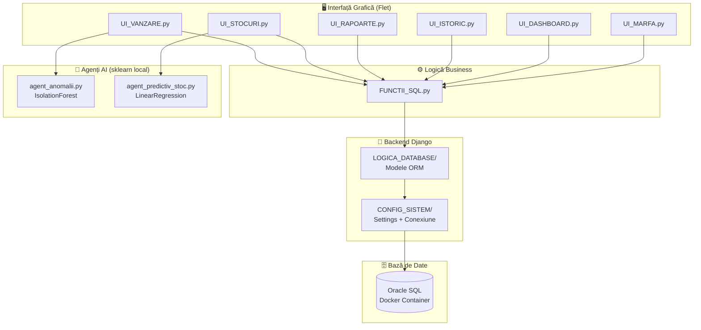
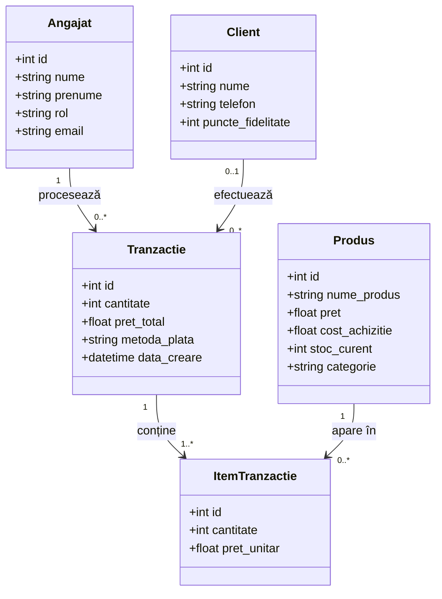
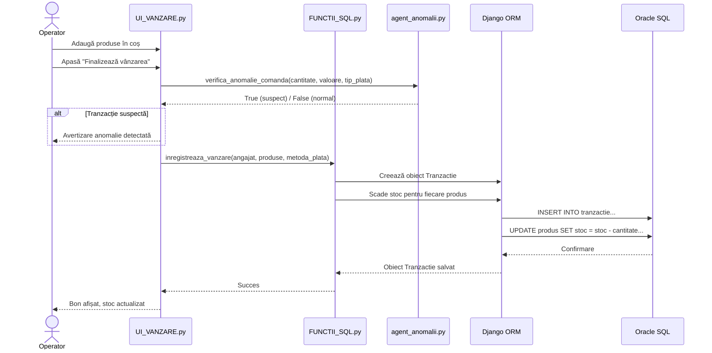
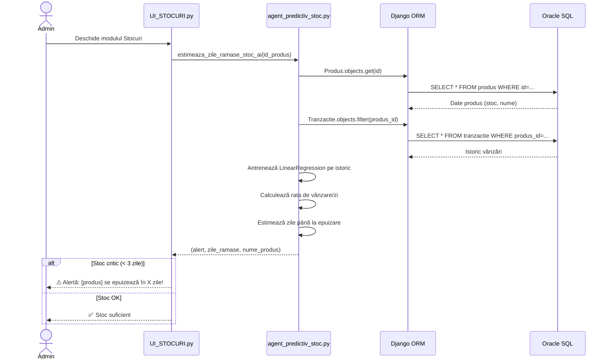
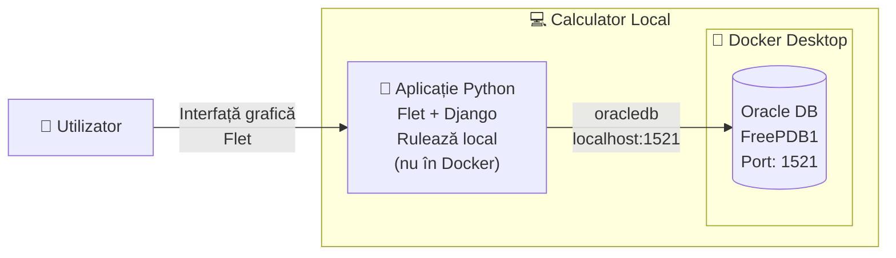

# Arhitectura Aplicației

Acest document descrie arhitectura sistemului **Casa de Marcat cu Extensie Administrativă**, incluzând diagrama componentelor, diagrama claselor și workflow-ul principal.

---

## 1. Diagrama Componentelor

---

## 2. Diagrama Claselor (Modele Django)

---

## 3. Workflow: Procesarea unei Vânzări

---

## 4. Workflow: Predicție Stoc

---

## 5. Arhitectura de Deployment (Docker)

> **Notă:** Aplicația Python rulează direct pe sistemul de operare (nu în container), dar se conectează la baza de date Oracle care rulează în Docker. Aceasta permite o interfață grafică nativă prin Flet.
